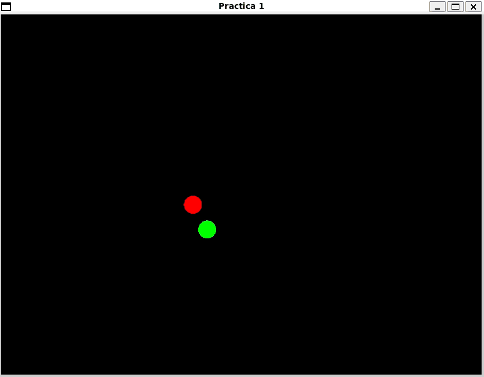
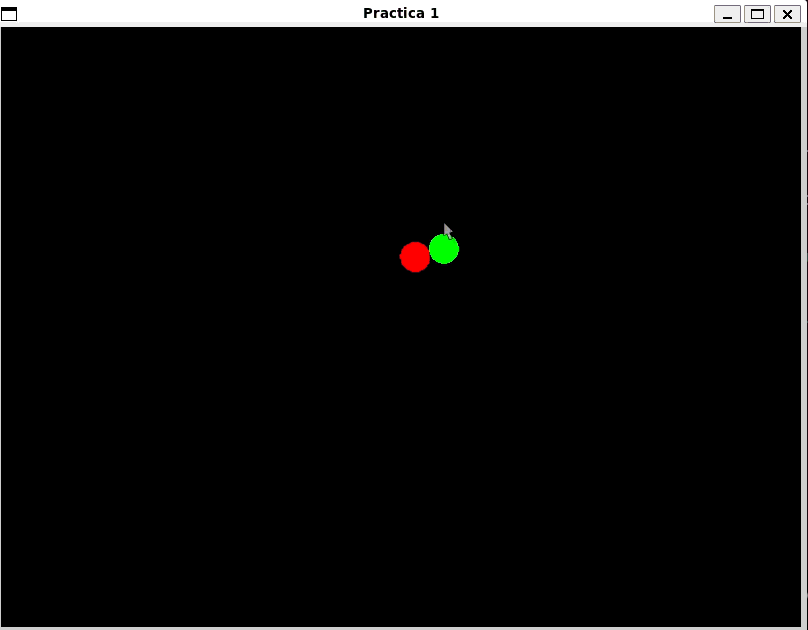

## Práctica 1: Fundamentos de POO y Linear Interpolation 

### Objetivos: 

- Practicar nociones básicas de la programación orientada a objetos en C++. 
- Practicar clases abstractas e interfaces en C++. 
- Implementar la lógica básica de un agente que persigue al jugador, tanto [`Player`](include/Player.h) como [`Enemy`](include/Enemy.h) implementan el comportamiento de [`Entity`](include/Entity.h). 
- Implementar dos tipos de movimientos para [`Enemy`](include/Enemy.h) a partir de la interfaz [`IMovementBehavior`](include/IAMovement/IMovementBehavior.h). 
    1. [`DirectMovement`](include/IAMovement/DirectMovement.h) utilizándo sólo resta de vectores y normalizando dirección (visto en laboratorio). 
    

    2. [`LerpMovement`](include/IAMovement/LerpMovement.h) utilizando interpolación lineal de la posición del agente a la posición del jugador. 
    

    3.  

<!--  -->
    **NOTA:** El movimiento directo puede ser más lento que el linear, el alumno tendrá que investigar y descubrir el por qué de este comportamiento y proponer valores para la velocidad de agente. 

