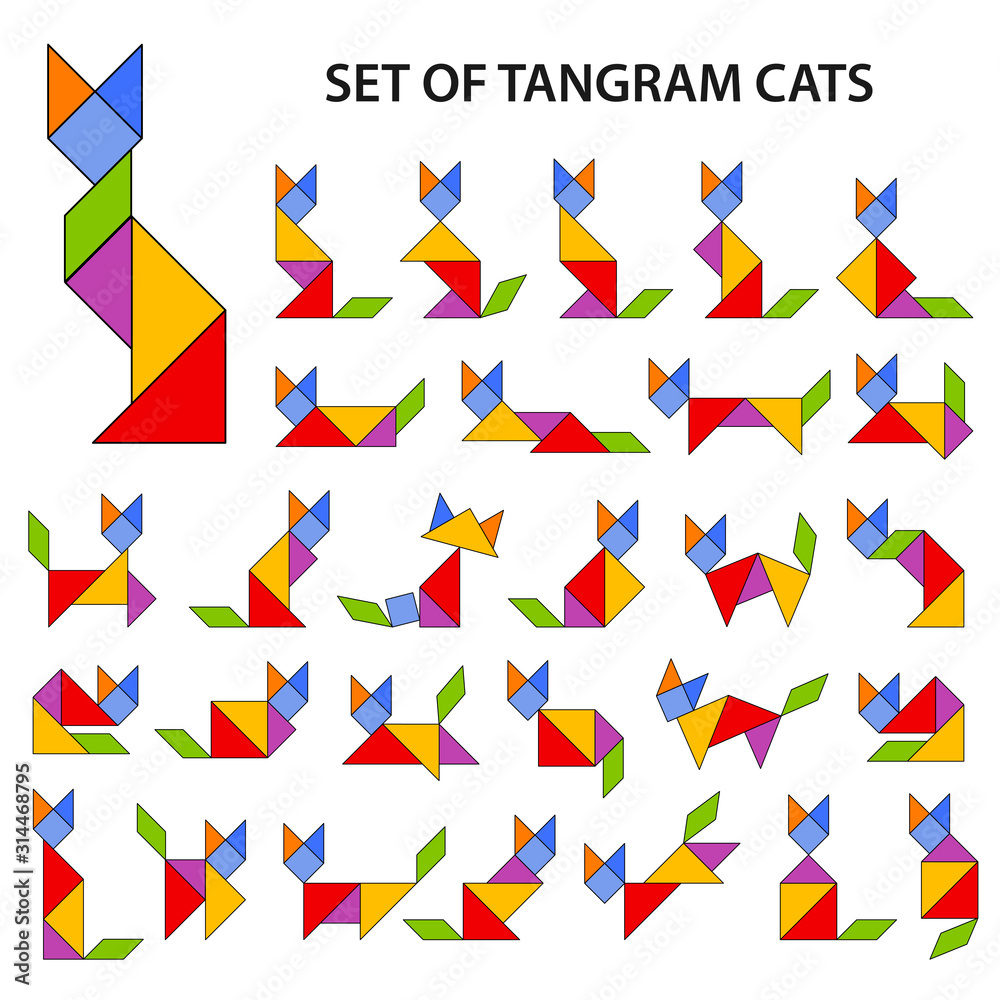
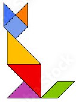
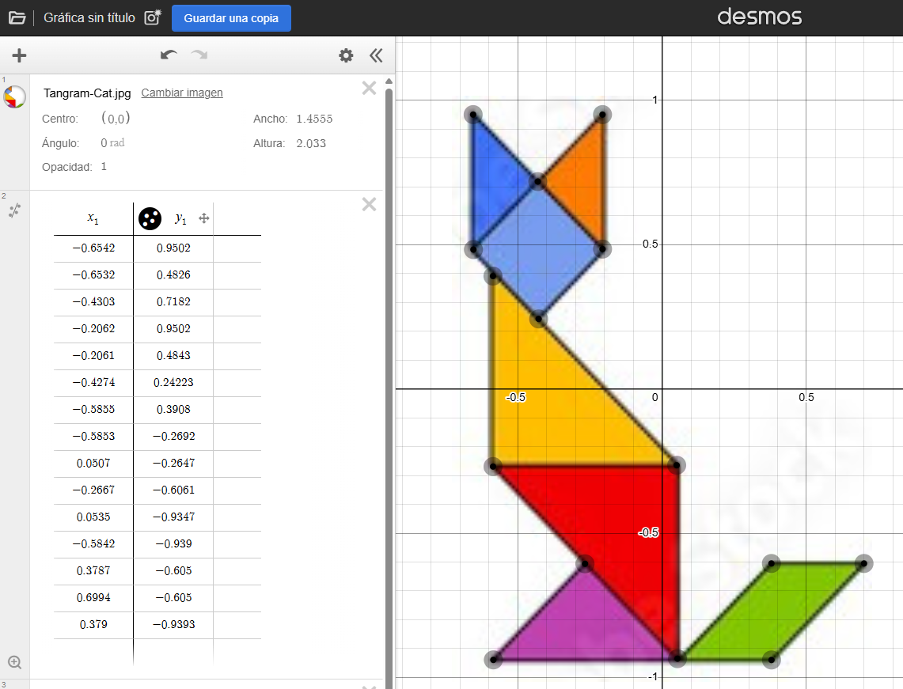
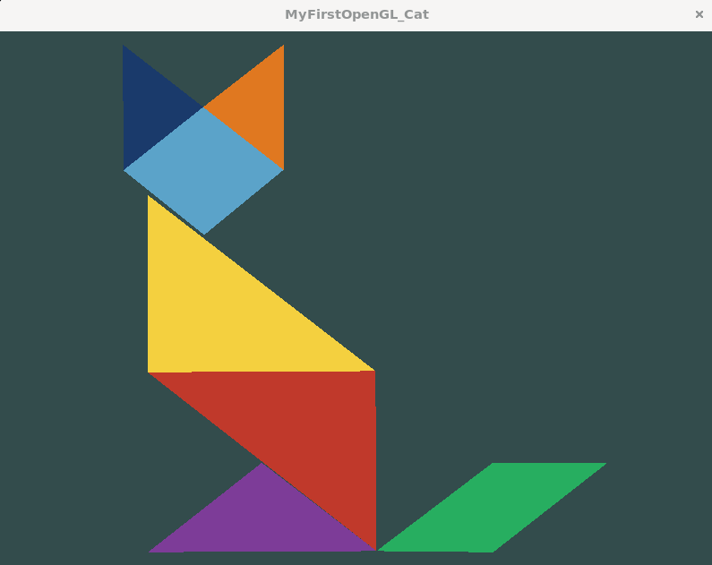

# Practica 2
<!-- Author: @steve-quezada -->

### Integrante
- Steve Quezada [@steve-quezada]

---

## Estructura del proyecto

```
2. Practica 2/
├── README.md                     ← Este archivo
├── CMakeLists.txt                ← Configuración CMake
│
├── shaders/
│   ├── vert/                     ← Vertex shaders (.vert): posición de vértices
│   │   └── basic.vert            ←     Vertex Generico
│   └── frag/                     ← Fragment shaders (.frag): color de cada píxel
│       ├── oreja_izq.frag        ←     Azul oscuro  #1A3A6B
│       ├── oreja_der.frag        ←     Naranja      #E07820
│       ├── cabeza.frag           ←     Azul claro   #5BA3C9
│       ├── pecho.frag            ←     Amarillo     #F4D03F
│       ├── cuerpo.frag           ←     Rojo         #C0392B
│       ├── pata.frag             ←     Morado       #7D3C98
│       └── cola.frag             ←     Verde        #27AE60
│
├── include/
│   ├── Window.h                  ← Encabezado clase Window
│   ├── ShaderProgram.h           ← Encabezado clase ShaderProgram
│   └── Polygon.h                 ← Encabezado clase Polygon
│
├── src/
│   ├── main.cpp                  ← Vértices del gato y ciclo de render
│   ├── Window.cpp                ← Inicialización GLFW/GLEW y ventana
│   ├── ShaderProgram.cpp         ← Lectura, compilación y enlace de shaders
│   └── Polygon.cpp               ← VAO + VBO
│
├── media/
│   ├── Set-Of-Tangram.jpg        ← Referencia: opciones de gato tangram
│   ├── Tangram-Cat.jpg           ← Referencia: tangram elegido
│   ├── Desmos-Tangram-Cat.png    ← Captura del proceso en Desmos
│   └── OpenGL-Tangram-Cat.png    ← Resultado final en OpenGL
│
└── build/                        ← (Generado) Binarios
    └── opengl_intro
```

---

## Compilacion y Ejecucion

```bash
# Configurar 
cmake -B build

# Compilar
cmake --build build

# Ejecutar
./build/opengl_intro
```

---

## El gato

La silueta del gato está construida con **7 triángulos**:

<div align="center">

| Parte | Triángulos | Color |
|---|---|---|
| Oreja izquierda | 1 | Azul oscuro |
| Oreja derecha | 1 | Naranja |
| Cabeza | 2 | Azul claro |
| Pecho | 1 | Amarillo |
| Cuerpo | 1 | Rojo |
| Pata | 1 | Morado |
| Cola | 2 | Verde |

</div>

---

## Referencia

<div align="center">

</div>

Se eligió esta figura:

<div align="center">

</div>

---

## Obtención de coordenadas [Desmos]

Las coordenadas se obtuvieron con [Desmos Graphing Calculator](https://www.desmos.com/calculator/ggumupgo3j?lang=es):

<div align="center">

</div>

---

## Resultado Final

<div align="center">

</div>