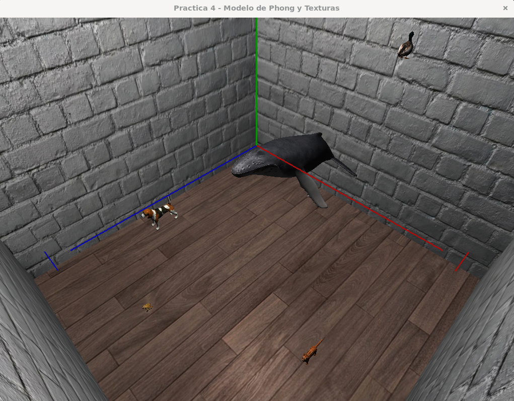
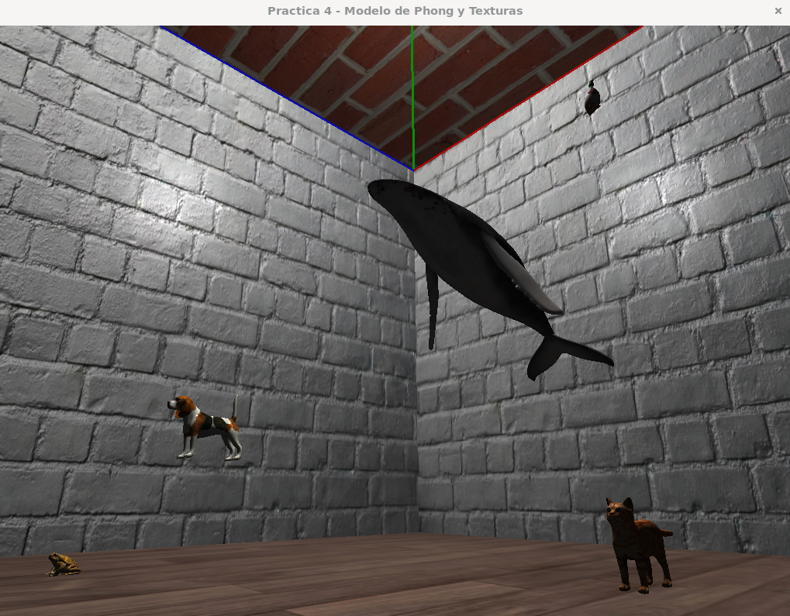
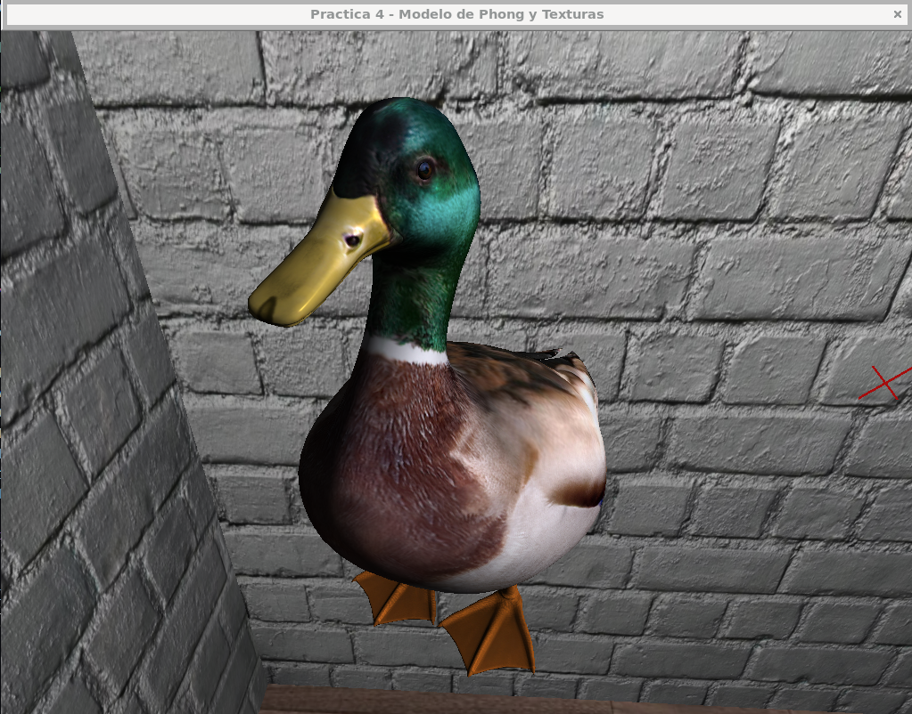
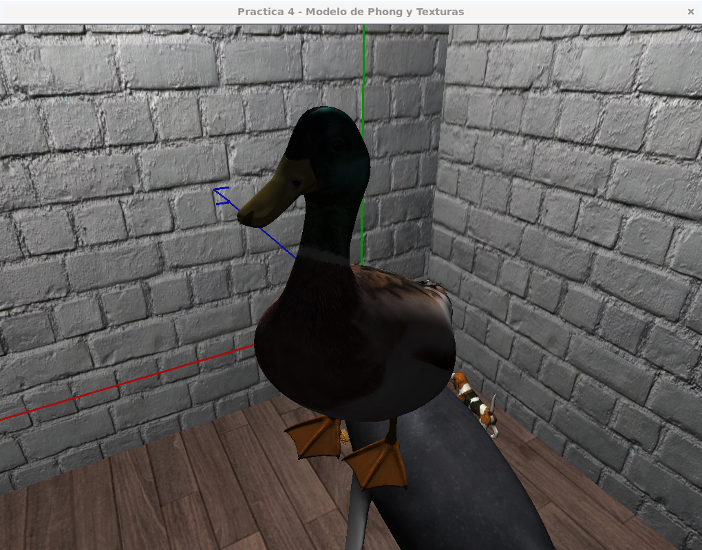
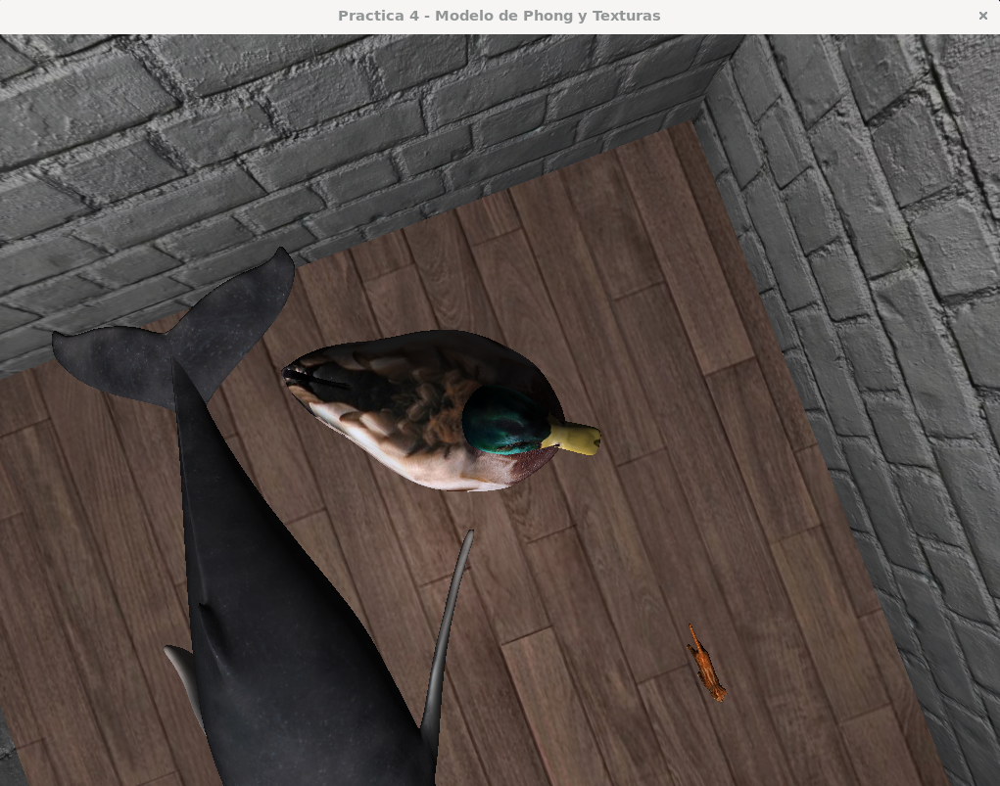
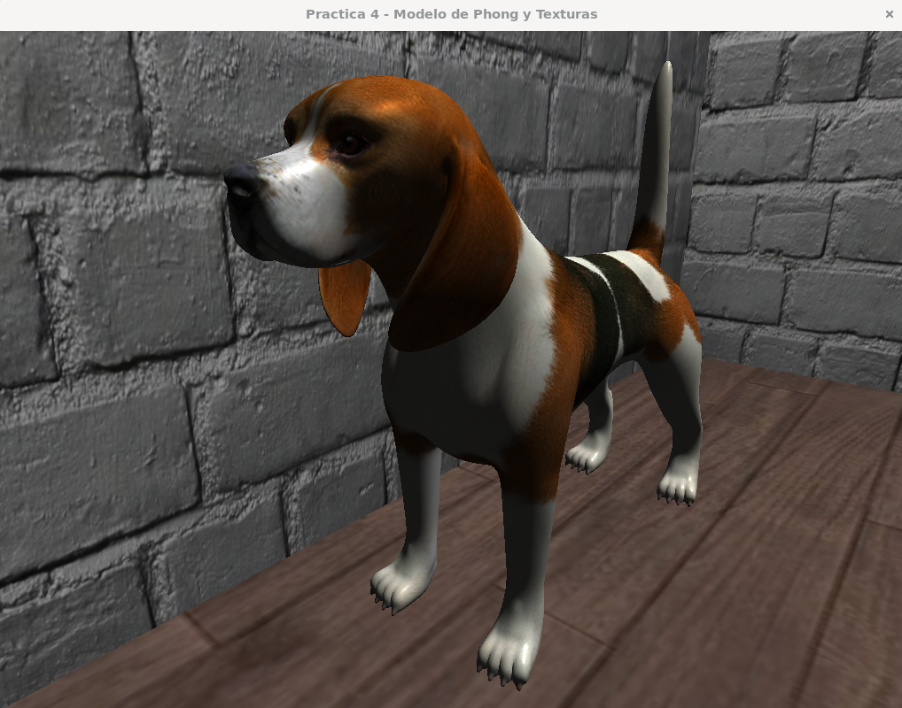

# Práctica 4 – Modelo de Phong y Texturas
<!-- Author: @steve-quezada -->

### Integrante
- Kevin Steve Quezada Ordoñez [@steve-quezada]

---

### Modelo de Phong

Se implementó el **Modelo de Phong** con una fuente de luz puntual en `(0, 8, 0)` (centro del techo del cubo).

---

## Estructura de archivos

```
4. Practica 4/
├── README.md                         ← Este archivo
├── CMakeLists.txt                    ← Configuración CMake (Linux y Windows)
│
├── assets/                           ← Recursos de la escena
│   ├── obj/                          ←     Modelos 3D
│   │   ├── Beagle.obj                
│   │   ├── Bird.obj                  
│   │   ├── Cat.obj                   
│   │   ├── Toad.obj                  
│   │   └── Whale.obj                 
│   └── textures/                     ←     Texturas
│       ├── Beagle.jpg                
│       ├── Bird.jpg                  
│       ├── Cat.jpg                   
│       ├── Toad.jpg                  
│       ├── Whale.jpg                 
│       └── room/                     ←     Texturas de la habitación
│           ├── floor.jpg             
│           ├── ceil.jpg              
│           └── wall.jpg              
│
├── shaders/                          ← Shaders GLSL
│   ├── vert/                         ←     Vertex shaders
│   │   ├── vertex.vert               ←         Phong: posición, normal y coords UV
│   │   └── axes.vert                 ←         Ejes XYZ: posición
│   └── frag/                         ←     Fragment shaders
│       ├── fragment.frag             ←         Phong: iluminación + textura
│       └── axes.frag                 ←         Ejes XYZ: color
│
├── include/                          ← Headers (.h) — declaraciones
│   ├── math/                         ←     Clases Matemáticas
│   │   ├── Vector3D.h                ←         Punto o dirección 3D (operaciones geométricas)
│   │   ├── Vector4D.h                ←         Vector3D con componente w (coordenada homogénea)
│   │   ├── Matrix3D.h                ←         Matriz 3×3 column-major (operaciones aritméticas)
│   │   └── Matrix4D.h                ←         Matriz 4×4 column-major (transformaciones y proyección)
│   │
│   ├── engine/                       ←     Motor gráfico OpenGL
│   │   ├── Window.h                  ←         Ventana GLFW + contexto GLEW
│   │   ├── ShaderProgram.h           ←         Lectura, compilación y enlace de shaders
│   │   └── Camera.h                  ←         Cámara FPS
│   │
│   ├── models/                       ←     Modelos 3D
│   │   ├── Model.h                   ←         Clase base abstracta (VAO, VBO, EBO)
│   │   ├── CustomModel.h             ←         Modelo .obj con textura SOIL2
│   │   ├── Room.h                    ←         Habitación Cubica
│   │   └── Axes.h                    ←         Ejes del mundo
│   │
│   ├── loaders/                      ←     Cargadores de archivos
│   │   └── ObjLoader.h               ←         Parser.obj
│   │
│   └── scene/                        ←     Orquestación
│       └── Scene.h                   ←         Ciclo principal, entrada y renderizado
│
├── src/                              ← Source (.cpp) — implementaciones
│   ├── main.cpp                      ←     Punto de entrada
│   ├── engine/
│   │   ├── Window.cpp
│   │   ├── ShaderProgram.cpp
│   │   └── Camera.cpp
│   ├── models/
│   │   ├── Model.cpp
│   │   ├── CustomModel.cpp
│   │   ├── Room.cpp
│   │   └── Axes.cpp
│   ├── loaders/
│   │   └── ObjLoader.cpp
│   └── scene/
│       └── Scene.cpp                 
│
├── media/                            ← Capturas de pantalla (Markdown)
│   ├── VistaSuperior.png             
│   ├── VistaInferior.png             
│   ├── PatoFrontal.png               
│   ├── PatoPosterior.png             
│   ├── PatoSuperior.png              
│   └── Beagle.png                    
│
└── build/                            ← (Generado) Binarios
    └── practica4                     ←     Ejecutable
```


## Ejecución
> [!NOTE]
> La compilación y ejecución fueron realizadas en WSL sobre Debian 13.3.

### Requisitos

- **Compilador C++20** (GCC 14.2.0)
- **CMake 3.31.6**
- **GLEW 2.2.0**
- **GLFW3 3.4.0**
- **OpenGL 4.5**
- **SOIL2 1.3.0**
---

### Compilación

```bash
# Configurar 
cmake -B build

# Compilar
cmake --build build

# Ejecutar
./build/practica4
```
---

## Controles

<div align="center">

| Tecla       | Acción                                     |
|-------------|--------------------------------------------|
| `W / S`     | Avanzar / Retroceder                       |
| `A / D`     | Mover Izquierda / Derecha                  |
| `Q / E`     | Subir / Bajar                              |
| `M`         | Alternar Modo (Clic + Raton / Raton Libre) |
| `Ratón`     | Rotar Vista                                |
| `1 / 2 / 3` | Modo Render (fill / wireframe / puntos)    |
| `ESC`       | Salir                                      |

</div>

> [!WARNING]
> El modo **Ratón Libre** no es compatible con WSL debido a limitaciones en la virtualización. 


---

## Imágenes

### Vista General

<div align="center">
  <table>
    <tr>
      <td align="center"><br/><sub>Superior</sub></td>
      <td align="center"><br/><sub>Inferior</sub></td>
    </tr>
  </table>
</div>

---

### Bird

<div align="center">
  <table>
    <tr>
      <td align="center"><br/><sub>Vista Frontal</sub></td>
      <td align="center"><br/><sub>Vista Posterior</sub></td>
    </tr>
  </table>
</div>

<div align="center">
  <table>
    <tr>
      <td align="center"><br/><sub>Vista Superior</sub></td>
    </tr>
  </table>
</div>

---

### Beagle

<div align="center">
  <table>
    <tr>
      <td align="center"><br/><sub>Vista Beagle</sub></td>
    </tr>
  </table>
</div>

---
