# Proyecto de Medio Semestre
<!-- Author: @steve-quezada -->

### Integrante
- Kevin Steve Quezada Ordoñez [@steve-quezada]

---

## Descripción

Visor de modelos 3D en formato `.obj` construido con OpenGL. Carga automáticamente todos los archivos de la carpeta `obj/`. Cada modelo se puede visualizar en tres modos: superficie, wireframe y nube de puntos. El modelo se puede rotar, trasladar y escalar. La cámara tiene dos modos: **orbital** (gira alrededor del modelo) y **libre** (movimiento en el espacio).

---

## Flujo de ejecución

Al iniciar, `main.cpp` crea un `Scene` en el stack, que en su constructor:

1. Se crea la **ventana** (`Window`) con GLFW y se inicializa GLEW.
2. Se compilan los **shaders** (`ShaderProgram`) con los archivos `vertex.vert` y `fragment.frag`.
3. Se crea la **cámara** (`Camera`) en modo orbital.
4. Se crean los **ejes del mundo** (`Axes`).
5. Se **escanea `obj/`** alfabéticamente y se crea un `CustomModel` por cada `.obj` encontrado.
6. La cámara se **enfoca automáticamente** en el primer modelo.
7. Entra el **bucle de render**: cada frame calcula `deltaTime`, procesa el teclado, limpia el buffer, dibuja los ejes, aplica el `glPolygonMode` del modo activo, dibuja el modelo actual y presenta el frame.

---

## Estructura del proyecto

```
1. Proyecto GC de Medio Semestre/
├── README.md                     ← Este archivo
├── CMakeLists.txt                ← Configuración CMake
│
├── include/                      ← Headers (.h) — declaraciones
│   ├── math/                     ←     Clases matemáticas
│   │   ├── Vector3D.h            ←         Punto o dirección en 3D (operaciones geométricas)
│   │   ├── Vector4D.h            ←         Vector con componente w (coordenadas homogéneas)
│   │   ├── Matrix3D.h            ←         Matriz 3×3 (operaciones aritméticas)
│   │   └── Matrix4D.h            ←         Matriz 4×4 (transformaciones y proyección)
│   ├── engine/                   ←     Motor gráfico OpenGL
│   │   ├── Window.h              ←         Ventana GLFW + contexto OpenGL
│   │   ├── ShaderProgram.h       ←         Compilación y enlace de shaders
│   │   └── Camera.h              ←         Cámara (orbital y libre)
│   ├── models/                   ←     Modelos 3D
│   │   ├── Model.h               ←         Clase base abstracta (VAO, VBO, EBO)
│   │   ├── CustomModel.h         ←         Modelo cargado desde archivo .obj
│   │   └── Axes.h                ←         Ejes del mundo
│   ├── loaders/                  ←     Cargadores de archivos
│   │   └── ObjLoader.h           ←         Parser de archivos .obj
│   └── scene/                    ←     Orquestación
│       └── Scene.h               ←         Ciclo principal, entrada y renderizado
│
├── src/                          ← Source (.cpp) — implementaciones
│   ├── main.cpp                  ←     Punto de entrada
│   ├── engine/
│   │   ├── Window.cpp
│   │   ├── ShaderProgram.cpp
│   │   └── Camera.cpp
│   ├── models/
│   │   ├── Model.cpp
│   │   ├── CustomModel.cpp
│   │   └── Axes.cpp
│   ├── loaders/
│   │   └── ObjLoader.cpp
│   └── scene/
│       └── Scene.cpp
│
├── shaders/                      ← Shaders GLSL
│   ├── vert/                     ←     Vertex shaders (.vert)
│   │   └── vertex.vert           ←         Posición de vértices
│   └── frag/                     ←     Fragment shaders (.frag)
│       └── fragment.frag         ←         Color interpolado
│
├── obj/                          ← Modelos 3D en formato obj
│   ├── airplane.obj
│   ├── bunny.obj
│   ├── cat.obj
│   ├── hand.obj
│   ├── plant.obj
│   └── teapot.obj               
│
├── media/                        ← Capturas de pantalla (Markdown)
│
└── build/                        ← (Generado) Binarios
    └── proyecto_medio            ←     Ejecutable
```

---

## Compilación y Ejecución
> Nota: la compilación y ejecución fueron realizadas en WSL sobre Debian 13.3.

### Requisitos

- **Compilador C++20** (GCC 14.2.0)
- **CMake 3.31.6**
- **GLEW 2.2.0**
- **GLFW3 3.4.0**
- **OpenGL 4.5**

### Compilación manual

```bash
# Configurar 
cmake -B build

# Compilar
cmake --build build

# Ejecutar
./build/proyecto_medio
```
---

## Controles

### Cámara orbital

<div align="center">

| Tecla | Acción |
|:---:|:---|
| `W` / `S` | Orbitar arriba / abajo |
| `A` / `D` | Orbitar izquierda / derecha |
| `Q` | Acercar |
| `E` | Alejar |

</div>

### Cámara libre (`C` para activar)

<div align="center">

| Tecla | Acción |
|:---:|:---|
| `W` / `S` | Avanzar / retroceder |
| `A` / `D` | Mover izquierda / derecha |
| `Q` / `E` | Subir / bajar |
| `←` / `→` | Girar izquierda / derecha |
| `↑` / `↓` | Girar arriba / abajo |

</div>

### Modelo — Rotar (`Shift` +)

<div align="center">

| Tecla | Acción |
|:---:|:---|
| `Shift` + `W` / `S` | Rotar en eje X |
| `Shift` + `A` / `D` | Rotar en eje Y |
| `Shift` + `Q` / `E` | Rotar en eje Z |

</div>

### Modelo — Trasladar (`Ctrl` +)

<div align="center">

| Tecla | Acción |
|:---:|:---|
| `Ctrl` + `A` / `D` | Trasladar en eje X |
| `Ctrl` + `W` / `S` | Trasladar en eje Y |
| `Ctrl` + `Q` / `E` | Trasladar en eje Z |

</div>

### Modelo — Escalar (`Ctrl` + `Shift` +)

<div align="center">

| Tecla | Acción |
|:---:|:---|
| `Ctrl` + `Shift` + `Q` | Agrandar modelo |
| `Ctrl` + `Shift` + `E` | Encoger modelo |

</div>

### General

<div align="center">

| Tecla | Acción |
|:---:|:---|
| `1` | Modo superficie |
| `2` | Modo wireframe |
| `3` | Modo nube de puntos |
| `Tab` | Siguiente modelo |
| `R` | Resetear transformación del modelo |
| `F` | Resetear cámara |
| `ESC` | Cerrar ventana |

</div>

---

## Explicación del código

### Clases matemáticas (`include/math/`)

- **`Vector3D`** — Representa un punto o dirección en el espacio tridimensional. Soporta las operaciones geométricas básicas: suma, resta, escalar, longitud, normalización, producto punto y producto cruz.

- **`Vector4D`** — Igual que `Vector3D` pero con una cuarta coordenada que distingue entre puntos y direcciones, necesaria para operar con matrices de transformación.

- **`Matrix3D`** — Matriz de 3×3 con operaciones aritméticas básicas: suma, multiplicación, transpuesta e inversa por cofactores.

- **`Matrix4D`** — Matriz de 4×4 usada para representar transformaciones (traslación, rotación, escala) y la proyección de perspectiva.

---

### Motor gráfico (`include/engine/`)

- **`Window`** — Abre la ventana del programa y configura el contexto gráfico.

- **`ShaderProgram`** — Lee los archivos `.vert` y `.frag`, los compila en la GPU y los enlaza en un programa.

- **`Camera`** — Controla el punto de vista. En modo orbital gira alrededor del modelo manteniéndolo siempre en el centro, en modo libre se puede desplazar y girar libremente por el espacio.

---

### Modelos (`include/models/`)

- **`Model`** — Base común de todos los objetos 3D. Se encarga de enviar la geometría a la tarjeta gráfica y de aplicar las transformaciones del modelo.

- **`CustomModel`** — Representa un modelo cargado desde un archivo `.obj`. Lo interpreta, lo sube a la GPU y lo dibuja en pantalla. También expone su centro y tamaño para que la cámara pueda enfocarse en él.

- **`Axes`** — Dibuja las tres líneas de referencia X, Y, Z con sus letras en los extremos. Su tamaño se adapta al del modelo que se está viendo.

---

### Carga de archivos (`include/loaders/`)

- **`ObjLoader`** — Interpreta el contenido de un archivo `.obj` y extrae los vértices y caras que lo componen. Asigna un color diferente a cada cara usando una paleta de 32 colores.

---

### Escena (`include/scene/`)

- **`Scene`** — Coordina todo el programa: inicializa los objetos, carga los modelos de la carpeta `obj/`, enfoca la cámara en el modelo activo, procesa la entrada del teclado cada fotograma y ejecuta el bucle de renderizado.

---

### Shaders (`shaders/`)

- **`vertex.vert`** — Calcula la posición de cada vértice en pantalla.
- **`fragment.frag`** — Calcula el color final de cada píxel interpolando entre los colores de los vértices.

---

## Imágenes

### Modos de visualización

<div align="center">
  <table>
    <tr>
      <td align="center">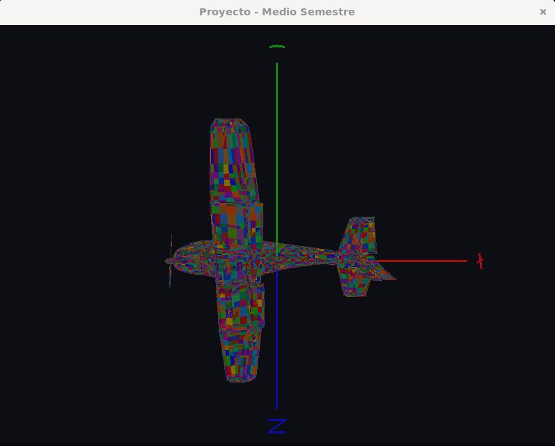<br/><sub>Superficie</sub></td>
      <td align="center">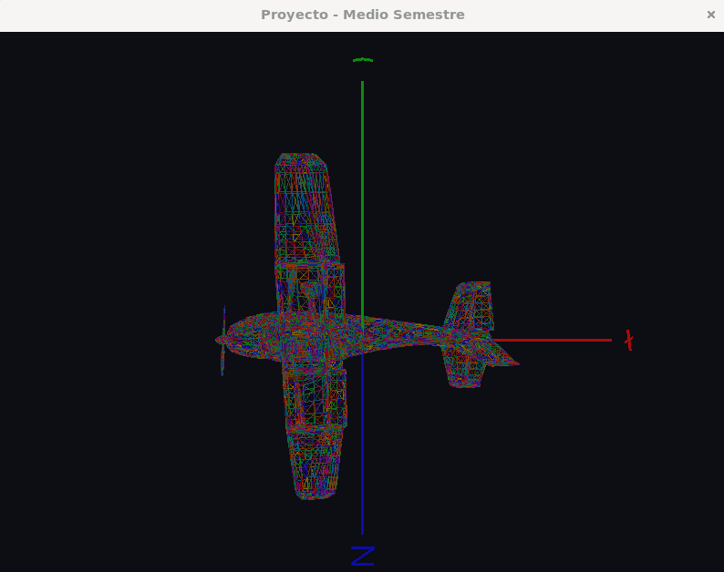<br/><sub>Wireframe</sub></td>
    </tr>
  </table>
</div>

<div align="center">
  <table>
    <tr>
      <td align="center">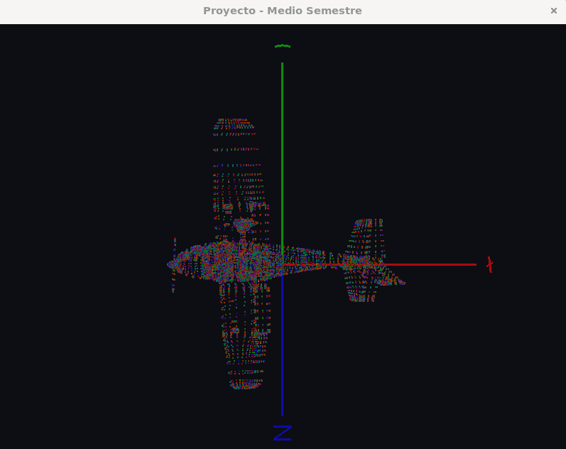<br/><sub>Nube de puntos</sub></td>
    </tr>
  </table>
</div>

---

### Cámara orbital

<div align="center">
  <table>
    <tr>
      <td align="center">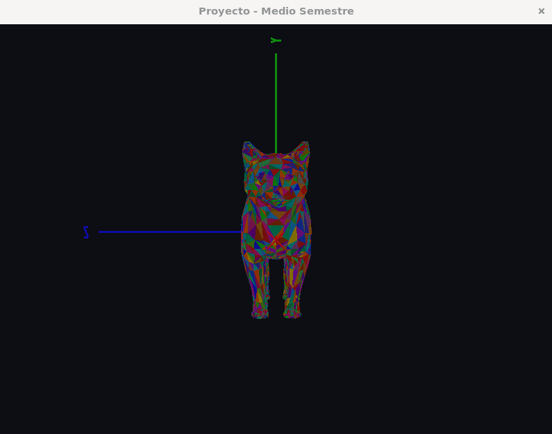<br/><sub>Vista frontal</sub></td>
      <td align="center">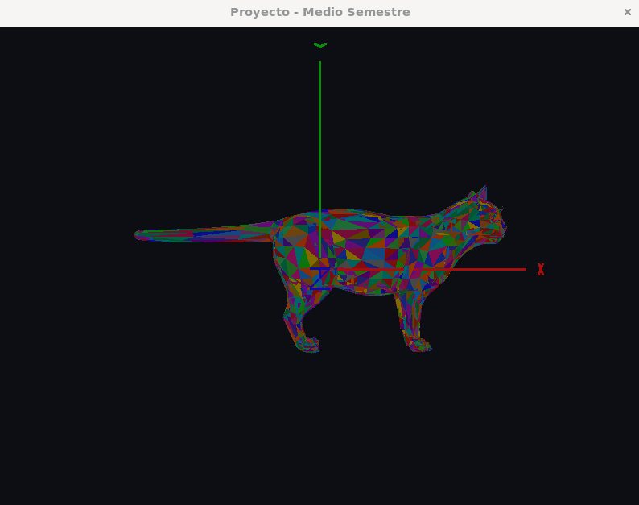<br/><sub>Vista lateral</sub></td>
    </tr>
  </table>
</div>

<div align="center">
  <table>
    <tr>
      <td align="center">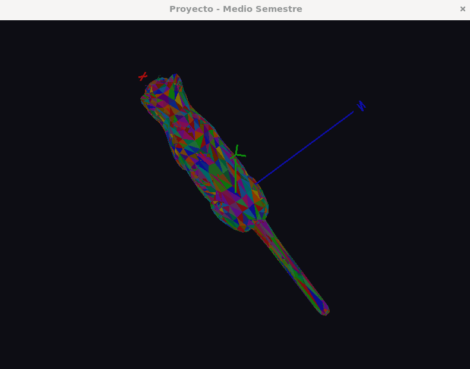<br/><sub>Vista superior</sub></td>
    </tr>
  </table>
</div>

---

### Cámara libre

<div align="center">
  <table>
    <tr>
      <td align="center">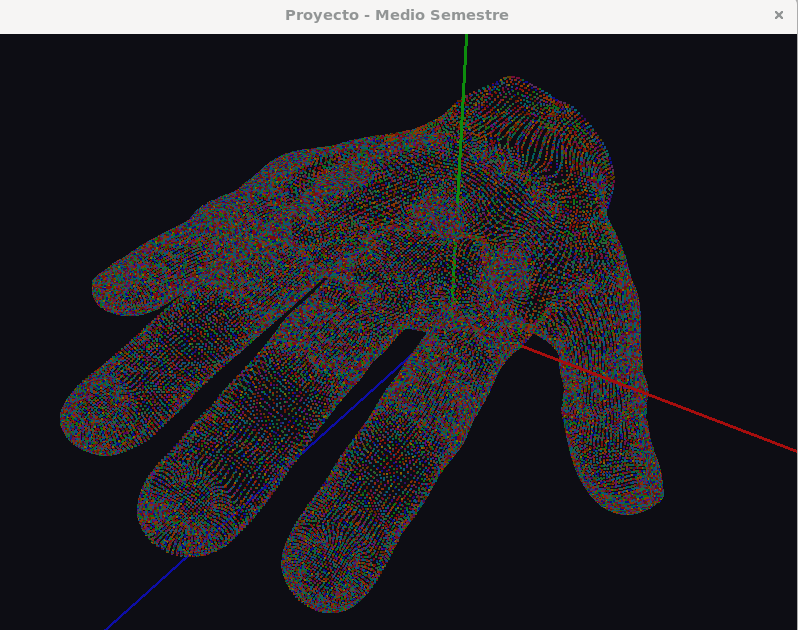<br/><sub>Vista 1</sub></td>
      <td align="center">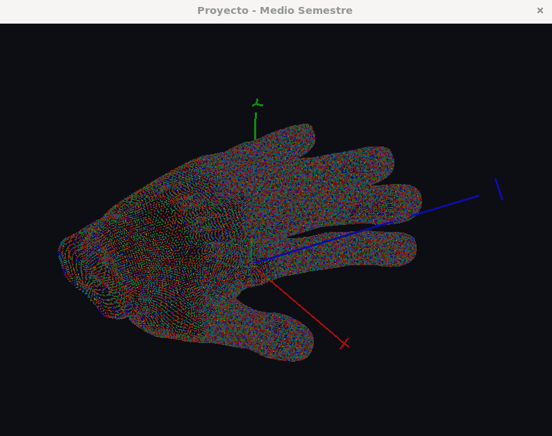<br/><sub>Vista 3</sub></td>
    </tr>
  </table>
</div>

<div align="center">
  <table>
    <tr>
      <td align="center">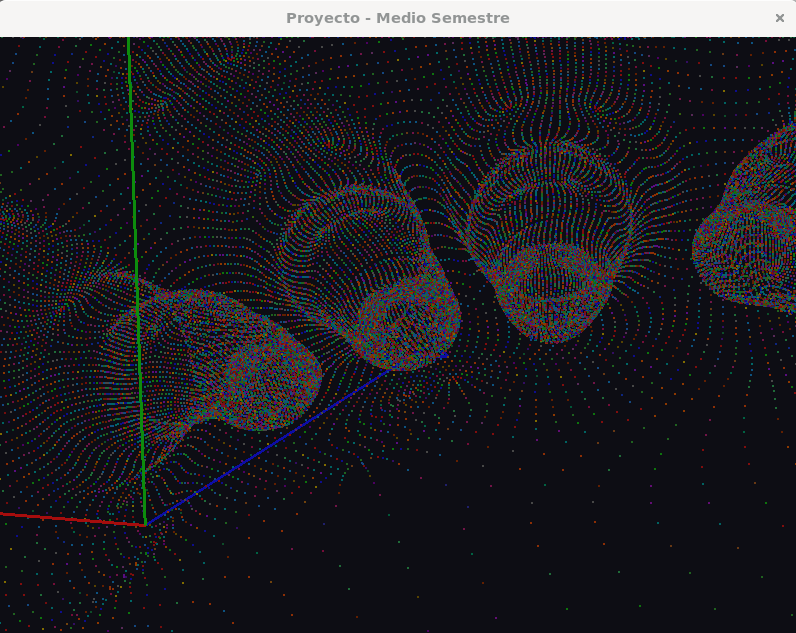<br/><sub>Vista 2</sub></td>
    </tr>
  </table>
</div>

---

### Rotar

<div align="center">
  <table>
    <tr>
      <td align="center">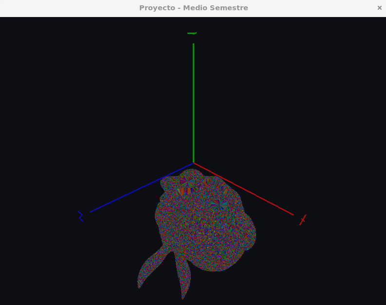<br/><sub>Eje X</sub></td>
      <td align="center">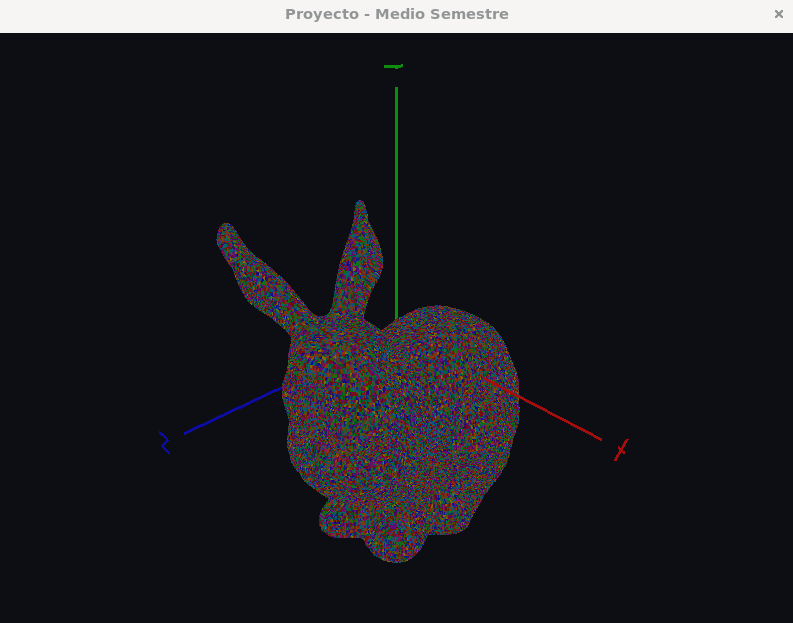<br/><sub>Eje Y</sub></td>
    </tr>
  </table>
</div>

<div align="center">
  <table>
    <tr>
      <td align="center">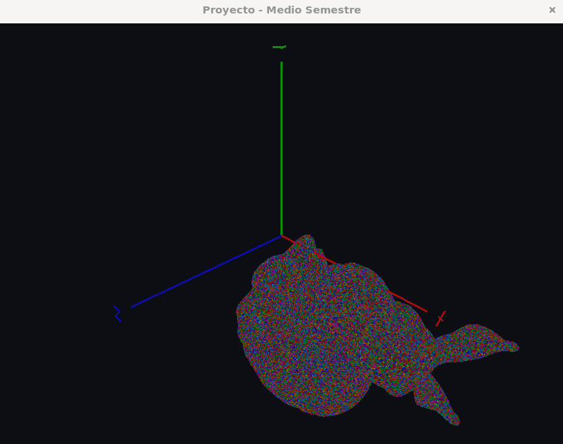<br/><sub>Eje Z</sub></td>
    </tr>
  </table>
</div>

---

### Trasladar

<div align="center">
  <table>
    <tr>
      <td align="center">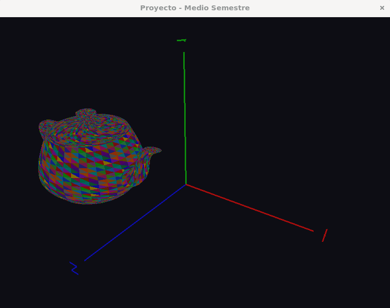<br/><sub>Eje X</sub></td>
      <td align="center">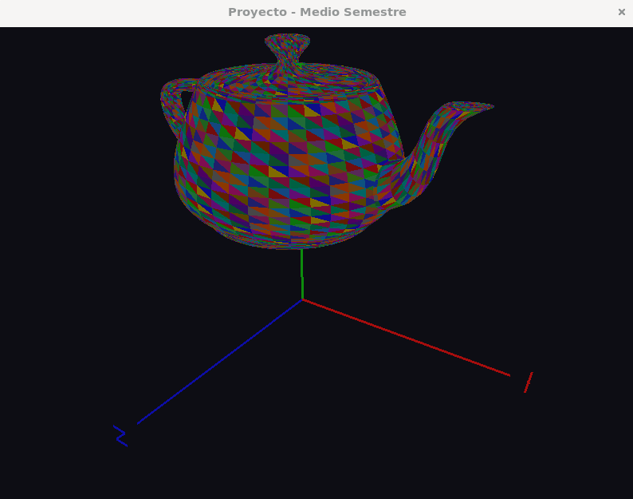<br/><sub>Eje Y</sub></td>
    </tr>
  </table>
</div>

<div align="center">
  <table>
    <tr>
      <td align="center">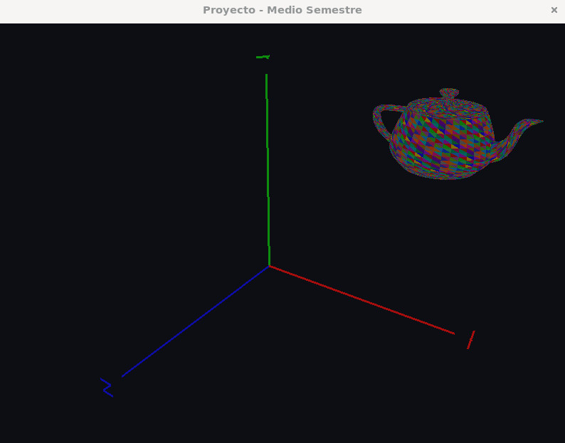<br/><sub>Eje Z</sub></td>
    </tr>
  </table>
</div>

---

### Escalar

<div align="center">
  <table>
    <tr>
      <td align="center">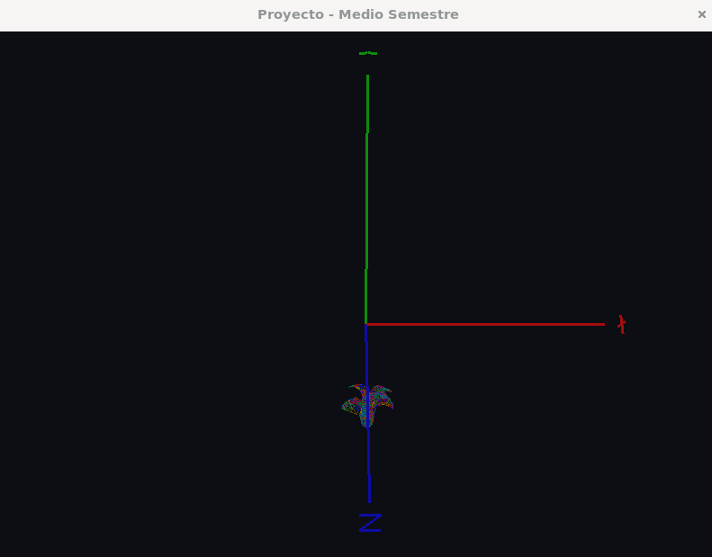<br/><sub>Encogido</sub></td>
      <td align="center">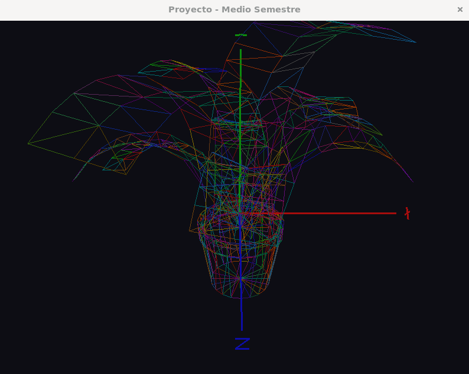<br/><sub>Agrandado</sub></td>
    </tr>
  </table>
</div>

<div align="center">
  <table>
    <tr>
    <td align="center">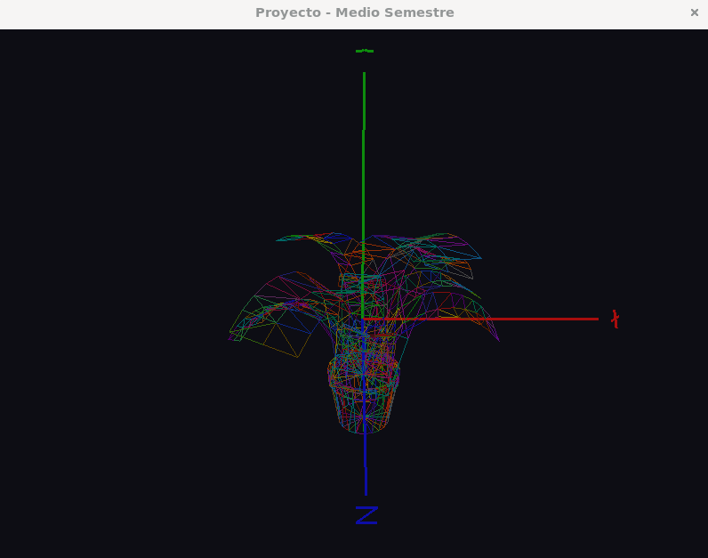<br/><sub>Escala original</sub></td>
    </tr>
  </table>
</div>

