# Proyecto Fin de Semestre
<!-- Author: @steve-quezada -->

### Integrante
- Kevin Steve Quezada Ordoñez [@steve-quezada]

---

## Descripción

Escena 3D interactiva construida con OpenGL que recrea un **aterrizaje alienígena nocturno en el Espacio Escultórico de la UNAM**. El terreno proviene de un escaneo fotogramétrico real del sitio. Un OVNI desciende periódicamente desde las alturas, ilumina la zona con su spotlight verde y vuelve a desaparecer. Una nave pequeña orbita el recinto mientras cuatro Banana-Cats custodian los puntos cardinales.

---


## Flujo de ejecución

Al iniciar, `main.cpp` crea un `Scene` en el stack, que en su constructor:

1. Se crea la **ventana** (`Window`) con GLFW y se inicializa GLEW.
2. Se compilan los **shaders** (`ShaderProgram`): Phong + texturas, Normal Mapping, Skybox y Ejes.
3. Se crea la **cámara** (`Camera`) en modo orbital centrada en el origen.
4. Se crean los **ejes del mundo** (`Axes`) elevados 1.5 unidades sobre el terreno.
5. Se configuran las **3 luces**: Luz lunar (azul-gris), Baliza central (roja) y Spotlight del OVNI (verde, activada dinámicamente).
6. Se **escanea `assets/obj/`** alfabéticamente; por cada `.obj` se crea un `CustomModel` con su textura `.jpg` correspondiente.
7. Al detectar el modelo UFO se carga su **Normal Map** (`UFO_normal.jpg`) y se prepara el VAO de Normal Mapping.
8. `positionModels()` ubica y escala cada modelo en la escena.
9. Entra el **bucle de render**: cada frame calcula `deltaTime`, procesa el teclado, limpia el buffer, renderiza Skybox → modelos OBJ → ejes.
10. El OVNI sigue una **máquina de estados**: Espera (30 s) → Descenso → Posado (15 s) → Ascenso → Espera...

---

## Requisitos del proyecto

| # | Requisito | Implementación |
|---|---|---|
| 1 | **4 modelos OBJ** | 5 modelos: Espacio Escultórico, UFO, Spaceship, Beacon, Banana-Cat |
| 2 | **3 luces** | Luz lunar (puntual), Baliza roja (puntual + atenuación), OVNI (spotlight) |
| 3 | **Textura** | Todos los modelos tienen textura `.jpg` cargada con SOIL2 |
| 4 | **Skybox** | Cielo estrellado con 6 caras cubemap en `assets/skybox/` |
| 5 | **Normal Mapping** | El UFO usa `normal.vert` + `normal.frag` con `UFO_normal.jpg` |
| 6 | **Cámara móvil** | Modo orbital y modo libre (C para alternar) |
| +1 | **Apagar shaders** | Tecla `F` — muestra textura plana sin Phong |
| +1 | **Apagar luces** | Tecla `L` — oscuridad ambiental mínima |
| +2 | **Animaciones** | OVNI: ciclo descenso/ascenso. Spaceship: órbita continua |

---

## Estructura del proyecto

```
2. Proyecto Fin de Semestre/
├── README.md                         ← Este archivo
├── CMakeLists.txt                    ← Configuración CMake (Windows y Linux/WSL)
│
├── assets/                           ← Recursos de la escena
│   ├── obj/                          ←     Modelos 3D
│   │   ├── Espacio-Escultorico.obj   ←         Terreno fotogramétrico
│   │   ├── UFO.obj                   ←         Nave alienígena
│   │   ├── Spaceship.obj             ←         Nave pequeña orbitante
│   │   ├── Beacon.obj                ←         Baliza en el centro del terreno
│   │   └── Banana-Cat.obj            ←         Personaje decorativo (4 instancias)
│   │
│   ├── textures/                     ←     Texturas de los modelos
│   │   ├── Espacio-Escultorico.jpg   ←         Foto aérea real del sitio
│   │   ├── UFO.jpg
│   │   ├── UFO_normal.jpg            ←         Normal map metálico
│   │   ├── Spaceship.jpg
│   │   ├── Beacon.jpg
│   │   └── Banana-Cat.jpg
│   │
│   └── skybox/                       ←     Cubemap del cielo estrellado
│       ├── right.jpg
│       ├── left.jpg
│       ├── top.jpg
│       ├── bottom.jpg
│       ├── front.jpg
│       └── back.jpg
│
├── shaders/                          ← Shaders GLSL
│   ├── vert/                         ←     Vertex shaders (.vert)
│   │   ├── vertex.vert               ←         Phong: posición, normal y coords UV
│   │   ├── normal.vert               ←         Normal Mapping: TBN + tangentes
│   │   ├── skybox.vert               ←         Skybox: posición del cubemap
│   │   └── axes.vert                 ←         Ejes XYZ: posición y color
│   │
│   └── frag/                         ←     Fragment shaders (.frag)
│       ├── fragment.frag             ←         Phong, luces y color grading nocturno
│       ├── normal.frag               ←         Normal Mapping mismo modelo de luces
│       ├── skybox.frag               ←         Muestreo del cubemap
│       └── axes.frag                 ←         Color plano de los ejes
│
├── include/                          ← Headers (.h) — declaraciones
│   ├── math/                         ←     Clases matemáticas propias
│   │   ├── Vector3D.h                ←         Punto o dirección en 3D (operaciones geométricas)
│   │   ├── Vector4D.h                ←         Vector con componente w (coordenadas homogéneas)
│   │   ├── Matrix3D.h                ←         Matriz 3×3 (operaciones aritméticas)
│   │   └── Matrix4D.h                ←         Matriz 4×4 (transformaciones y proyección)
│   │
│   ├── engine/                       ←     Motor gráfico OpenGL
│   │   ├── Window.h                  ←         Ventana GLFW + contexto GLEW
│   │   ├── ShaderProgram.h           ←         Compilación y enlace de shaders
│   │   └── Camera.h                  ←         Cámara orbital y libre
│   │
│   ├── models/                       ←     Modelos 3D
│   │   ├── Model.h                   ←         Clase base abstracta (VAO, VBO, EBO)
│   │   ├── CustomModel.h             ←         Modelo .obj, textura y Normal Mapping
│   │   ├── SkyBox.h                  ←         Cubemap del cielo
│   │   ├── Axes.h                    ←         Ejes del mundo XYZ
│   │   └── Room.h                    ←         (Legado)
│   │
│   ├── loaders/                      ←     Cargadores de archivos
│   │   └── ObjLoader.h               ←         Parser de archivos .obj
│   │
│   └── scene/                        ←     Orquestación
│       └── Scene.h                   ←         Ciclo principal, entrada y renderizado
│
├── src/                              ← Source (.cpp) — implementaciones
│   ├── main.cpp                      ←     Punto de entrada
│   ├── engine/
│   │   ├── Window.cpp
│   │   ├── ShaderProgram.cpp
│   │   └── Camera.cpp
│   ├── models/
│   │   ├── Model.cpp
│   │   ├── CustomModel.cpp           
│   │   ├── SkyBox.cpp
│   │   ├── Axes.cpp
│   │   └── Room.cpp                  
│   ├── loaders/
│   │   └── ObjLoader.cpp
│   └── scene/
│       └── Scene.cpp
│
├── media/                            ← Capturas de pantalla (Markdown)
│
└── build/                            ← (Generado) Binarios 
    └── proyecto_final                ←     Ejecutable
```

---

## Ejecución
> [!NOTE]
> La compilación y ejecución fueron realizadas en WSL sobre Debian 13.3.

### Requisitos

- **Compilador C++20** (GCC 14.2.0)
- **CMake 3.31.6**
- **GLEW 2.2.0**
- **GLFW3 3.4.0**
- **OpenGL 4.5**
- **SOIL2 1.3.0**
---

### Compilación

```bash
# Configurar 
cmake -B build

# Compilar
cmake --build build

# Ejecutar
./build/proyecto_final
```
---

## Controles

<div align="center">

| Tecla | Acción |
|:---:|:---|
| `W / S` | Avanzar / Retroceder |
| `A / D` | Mover izquierda / derecha |
| `Q / E` | Subir / Bajar (libre) — Zoom (orbital) |
| `↑ ↓ ← →` | Rotar / Orbitar vista |
| `C` | Alternar cámara (Libre / Orbital) |
| `L` | Encender / Apagar luces |
| `F` | Encender / Apagar shaders Phong |
| `X` | Mostrar / Ocultar ejes |
| `P` | Pausar / Reanudar animaciones (OVNI + Spaceship) |
| `1 / 2 / 3` | Modo render (Superficie / Wireframe / Puntos) |
| `ESC` | Cerrar ventana |

</div>

---

### Sistema de iluminación

La escena usa el **modelo de Phong** con 3 luces independientes.

| Luz | Tipo | Color | Rol |
|---|---|---|---|
| 0 — Lunar | Puntual | Azul-gris frío | Iluminación ambiental de la escena nocturna |
| 1 — Baliza | Puntual + atenuación | Rojo | Señal de aterrizaje en el centro del terreno |
| 2 — OVNI | Spotlight (cono) | Verde fosforescente | Sigue a la nave; se activa/desactiva con el ciclo |

Los tres componentes Phong (**ambiental, difuso, especular**) se calculan en el fragment shader. El material varía por modelo:

- **Espacio Escultórico**: `shininess=10`, `matSpecular=vec3(0.05)` — concreto opaco sin brillo plástico.
- **OVNI**: `shininess=128`, `matSpecular=vec3(1.0)` — metal pulido con reflejo concentrado.
- **Resto**: `shininess=24`, `matSpecular=vec3(0.15)` — semi-mate por defecto.

La **Baliza** aplica atenuación cuadrática para que su luz roja no alcance modelos lejanos. El **spotlight del OVNI** usa un cono suavizado entre ángulo interior (8°) y exterior (20°).

Al final de cada fragment shader se aplica un **color grading nocturno**: desaturación al 75%, tinte azulado `(0.90, 0.96, 1.06)` y ajuste de exposición para coherencia con el skybox estelar.

---

## Imágenes

### Vista general

<div align="center">
  <table>
    <tr>
      <td align="center">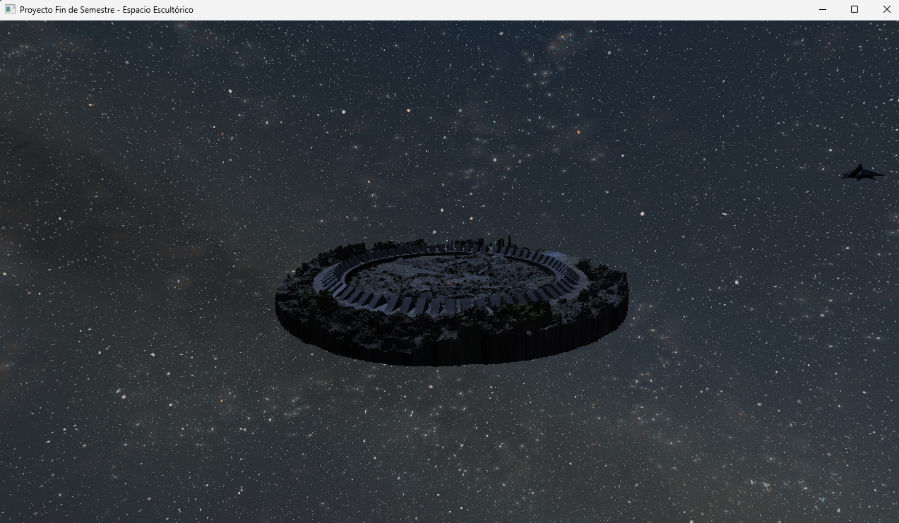<br/><sub>Vista inicial</sub></td>
      <td align="center">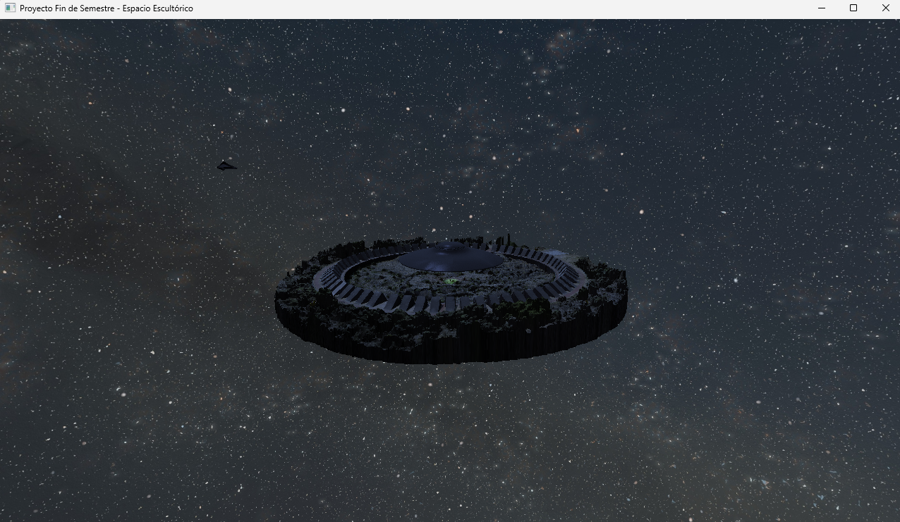<br/><sub>OVNI en descenso</sub></td>
    </tr>
  </table>
</div>

---

### OVNI

<div align="center">
  <table>
    <tr>
      <td align="center">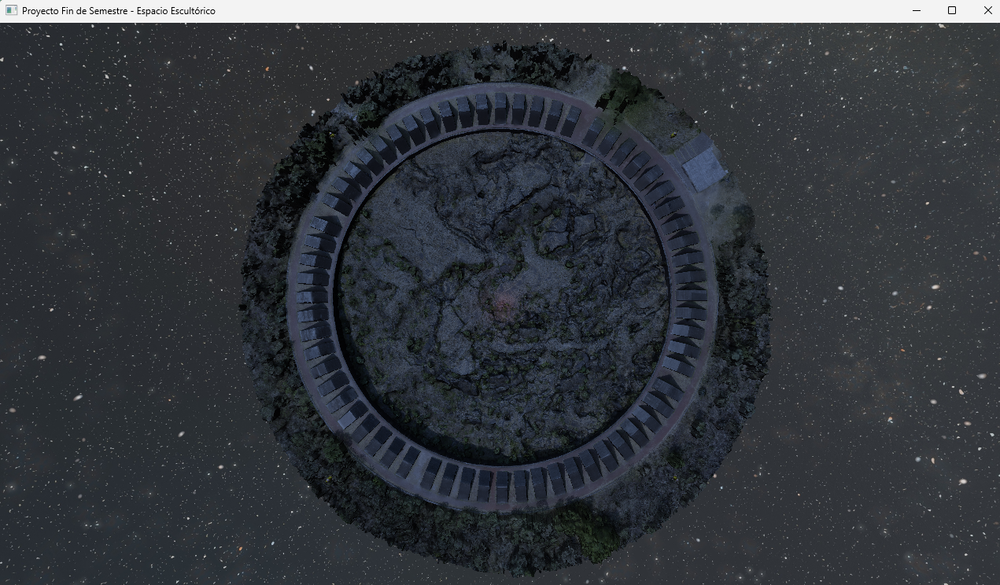<br/><sub>Vista superior</sub></td>
      <td align="center">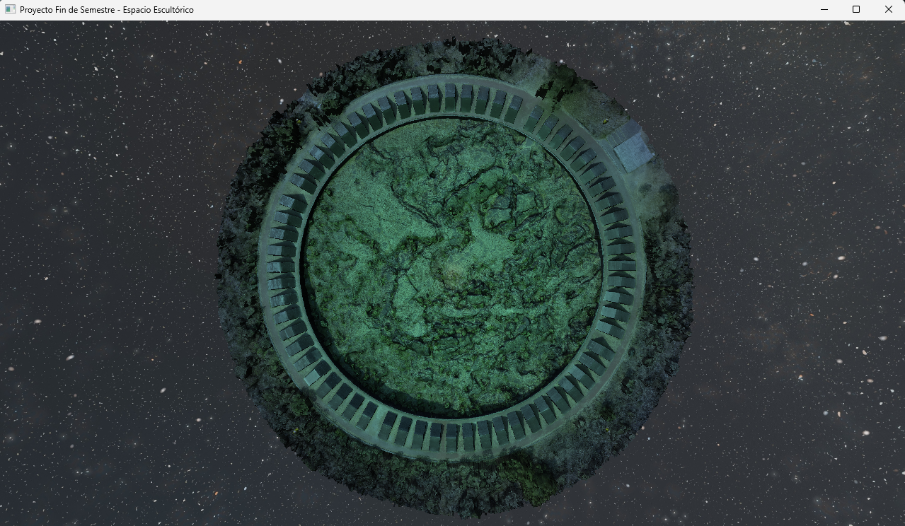<br/><sub>Spotlight desde arriba</sub></td>
    </tr>
  </table>
</div>

---

### Modelos

<div align="center">
  <table>
    <tr>
      <td align="center">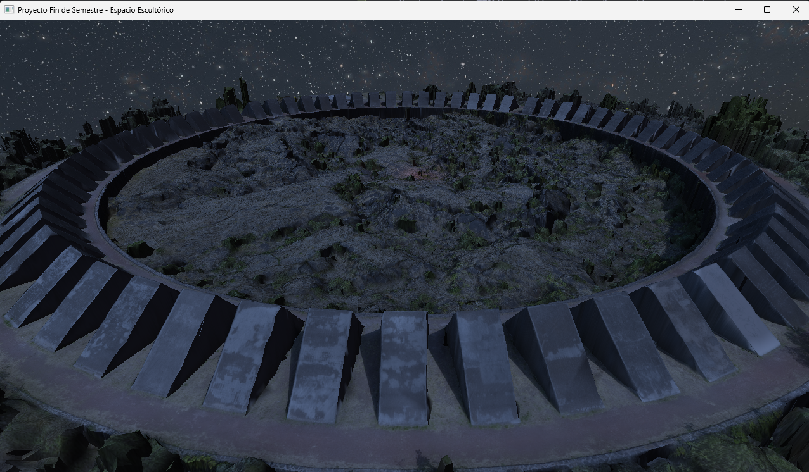<br/><sub>Espacio Escultórico</sub></td>
    </tr>
  </table>
</div>

<div align="center">
  <table>
    <tr>
      <td align="center">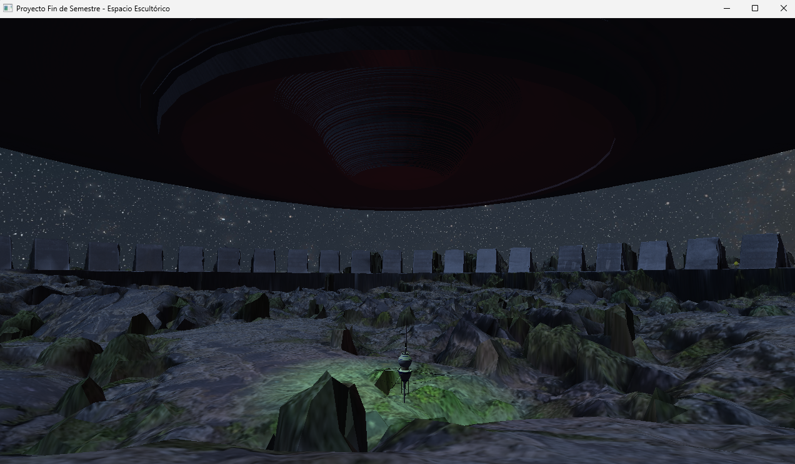<br/><sub>Baliza</sub></td>
    </tr>
  </table>
</div>

<div align="center">
  <table>
    <tr>
      <td align="center">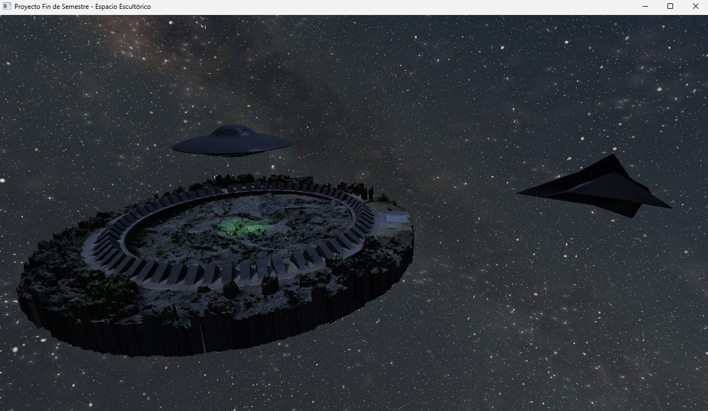<br/><sub>Spaceship</sub></td>
    </tr>
  </table>
</div>

<div align="center">
  <table>
    <tr>
      <td align="center">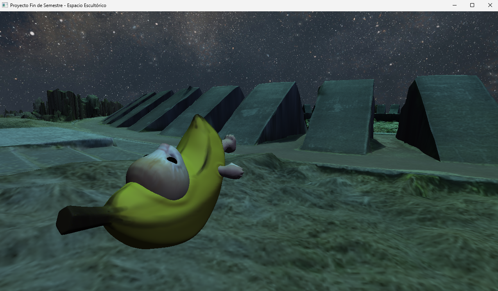<br/><sub>Banana-Cat</sub></td>
    </tr>
  </table>
</div>

---

### Modos de render

<div align="center">
  <table>
    <tr>
      <td align="center">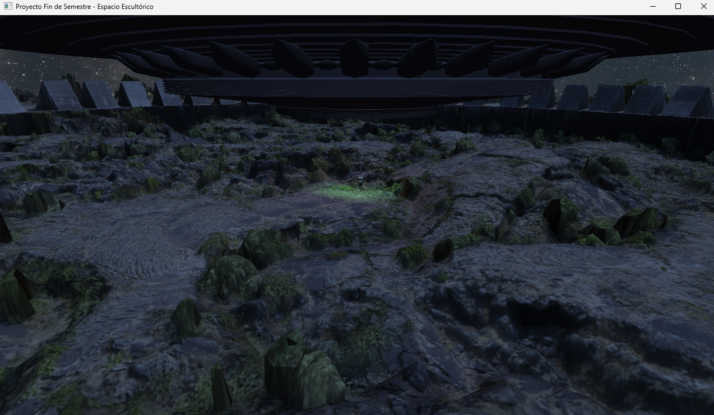<br/><sub>Superficie</sub></td>
      <td align="center">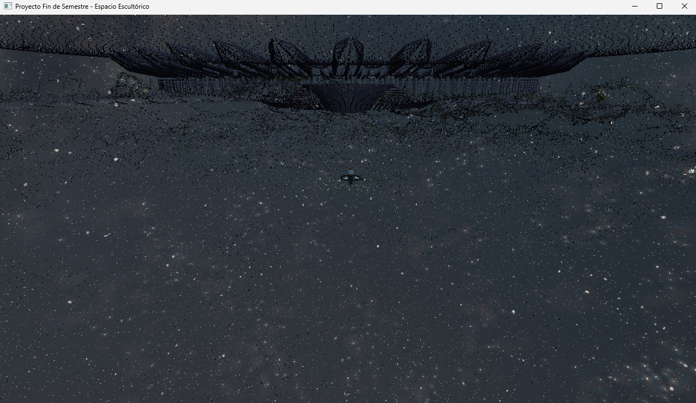<br/><sub>Nube de puntos</sub></td>
    </tr>
  </table>
</div>

<div align="center">
  <table>
    <tr>
      <td align="center">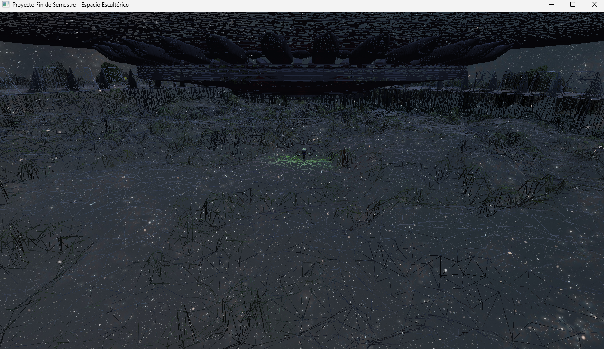<br/><sub>Wireframe</sub></td>
    </tr>
  </table>
</div>

---

### Toggles

<div align="center">
  <table>
    <tr>
      <td align="center">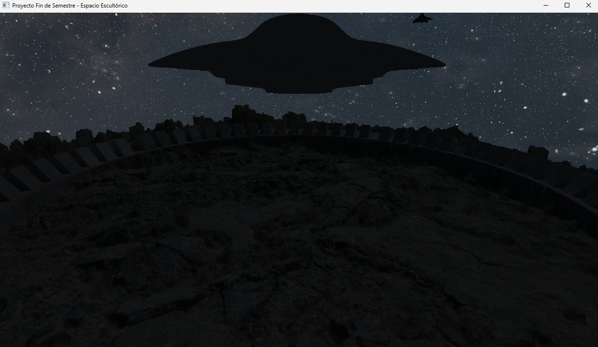<br/><sub>Luces apagadas (L)</sub></td>
      <td align="center">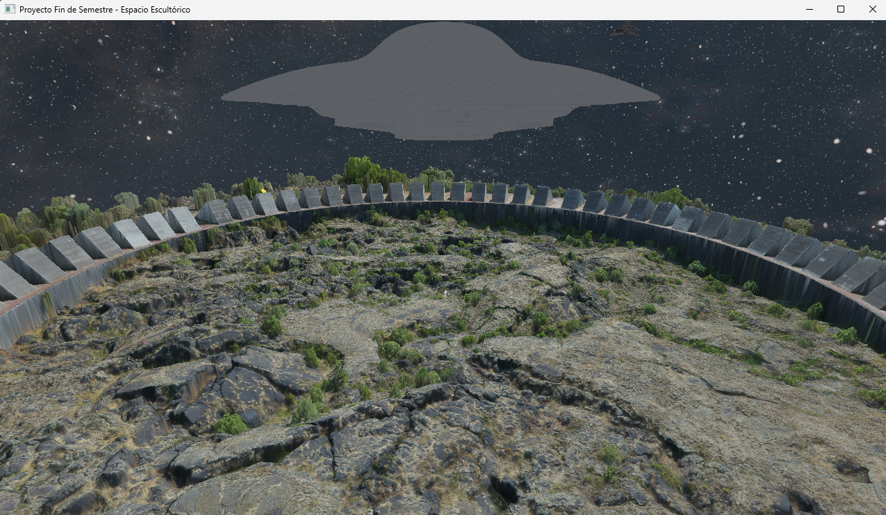<br/><sub>Shaders apagados (F)</sub></td>
    </tr>
  </table>
</div>

<div align="center">
  <table>
    <tr>
      <td align="center">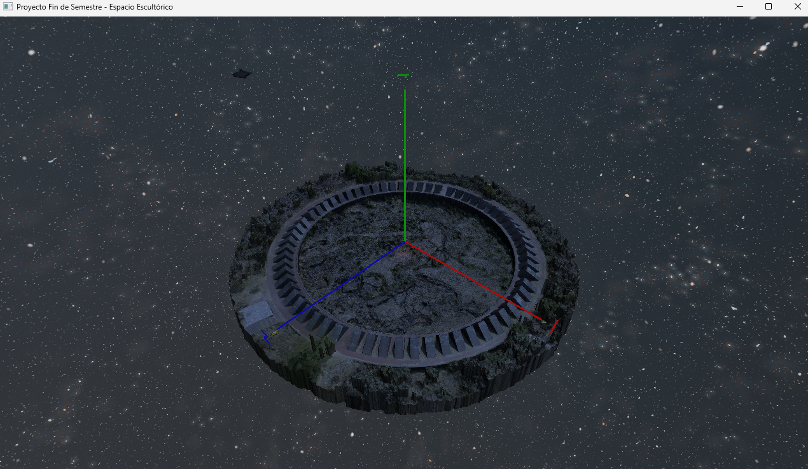<br/><sub>Ejes visibles (X)</sub></td>
    </tr>
  </table>
</div>

