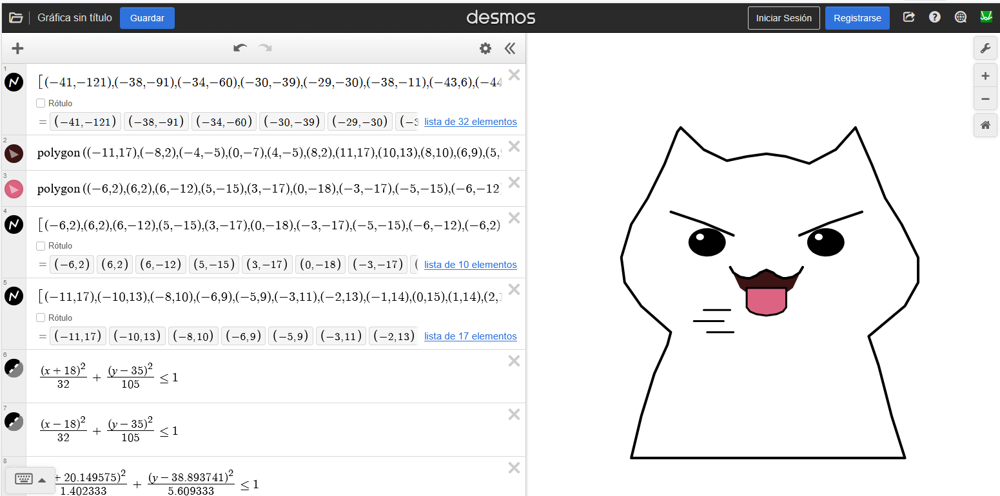
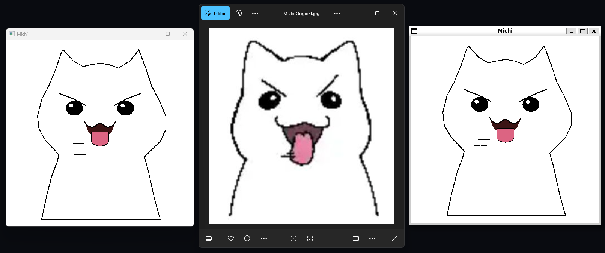

# Tarea 02 - Dibujo con Píxeles (C++ + SFML)
<!-- Author: @steve-quezada -->

### Integrante
- Steve Quezada (@steve-quezada)

---

## Descripción

Programa que dibuja una imagen (gato) píxel a píxel usando SFML. Se implementan las primitivas geométricas y curvas de Bézier, se incluye el algoritmo de Chaikin para suavizado y una animación progresiva del dibujo.

## Fórmulas matemáticas

Interpolación lineal:
$$P(t) = (1 - t) P_0 + t P_1,\quad t\in[0,1]$$

Bézier cuadrática:
$$B(t) = (1-t)^2 P_0 + 2(1-t)t P_1 + t^2 P_2$$

Bézier cúbica:
$$B(t) = (1-t)^3 P_0 + 3(1-t)^2 t P_1 + 3(1-t) t^2 P_2 + t^3 P_3$$

Chaikin (subdivisión):
$$Q_i=\tfrac{3}{4}P_i+\tfrac{1}{4}P_{i+1},\quad R_i=\tfrac{1}{4}P_i+\tfrac{3}{4}P_{i+1}$$

---

## Estructura del proyecto

```
DibujoPixeles/
├── README.md                  ← Este archivo
├── CMakeLists.txt             ← Configuración CMake
├── build.ps1                  ← Script compilación Windows (PowerShell)
├── build.sh                   ← Script compilación Linux/macOS (Bash)
├── desmos/
│   ├── desmos_michi.js        ← Script para cargar coordenadas en Desmos
│   └── SS-desmos.png          ← Captura de Desmos
│
├── include/
│   └── Dibujo.h               ← Encabezado clase Dibujo
│
├── src/
│   ├── main.cpp               ← Programa principal (SFML + animación)
│   └── Dibujo.cpp             ← Implementación primitivas y utilidades
│
├── build-windows/             ← (Generado) Binarios Windows
│   └── dibujo.exe
│
├── build-wsl/                 ← (Generado) Binarios WSL/Linux
│   └── dibujo
│
└── build-linux/               ← (Generado) Binarios Linux
	└── dibujo
```

---

## Compilación y Ejecución

### Opción 1: Scripts Automáticos

#### Windows (PowerShell)
```powershell
# Editar build.ps1 linea 20 si SFML está en otra ubicación
$SFML_DIR = "C:/SFML-3.0.2/lib/cmake/SFML"

# Ejecutar
.\build.ps1
```

#### Linux / macOS (Bash)
```bash
chmod +x build.sh
./build.sh linux

# macOS
./build.sh macos
```

### Opción 2: Compilación Manual con CMake

#### Windows (MinGW)
```powershell
mkdir build-windows
cd build-windows

# Configurar CMake con MinGW
cmake -G "MinGW Makefiles" -DSFML_DIR="C:/SFML-3.0.2/lib/cmake/SFML" -DCMAKE_BUILD_TYPE=Release ..

# Compilar
mingw32-make

# Ejecutar
.\dibujo.exe
```

#### Linux / macOS
```bash
mkdir build-linux
cd build-linux

# Configurar 
cmake -DCMAKE_BUILD_TYPE=Release ..

# Compilar
cmake --build .

# Ejecutar
./dibujo
```

---

## Controles

- Flecha Derecha: acelerar (+20 píxeles/frame)
- Flecha Izquierda: desacelerar (-20 píxeles/frame)
- ENTER: pausar / reanudar
- R: reiniciar
- Cerrar ventana: salir

---

## Animación 

1. En el inicio se precalculan y almacenan todos los píxeles del dibujo en un objeto `Dibujo`.
2. Durante el bucle principal se dibujan solo los primeros `N` píxeles mediante `drawPartial(window,N)`, incrementando `N` cada frame.
3. La variable `velocidad` controla cuántos píxeles se muestran por frame.

---

## Recursos adicionales

- Se añadió `desmos_michi.js`: script para inyectar en Desmos las coordenadas del modelo (las mismas usadas en `src/main.cpp`) y visualizar el contorno y detalles del dibujo.
- Archivo: `desmos_michi.js`

- Captura (Desmos):
	

---

## Capturas de ejecución

### P1 — Windows
**Descripción:** Ejecución en Windows (generada en `build-windows`).

<p align="center">
	
</p>

### P0 — Original
**Descripción:** Imagen original.

<p align="center">
	
</p>

### P1-P0-P1 — Muestra
**Descripción:** Generado en Windows (P1), Original (P0), Generado en WSL (P1)

<p align="center">
	
</p>